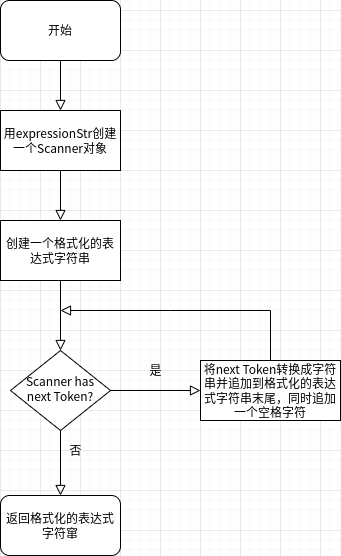
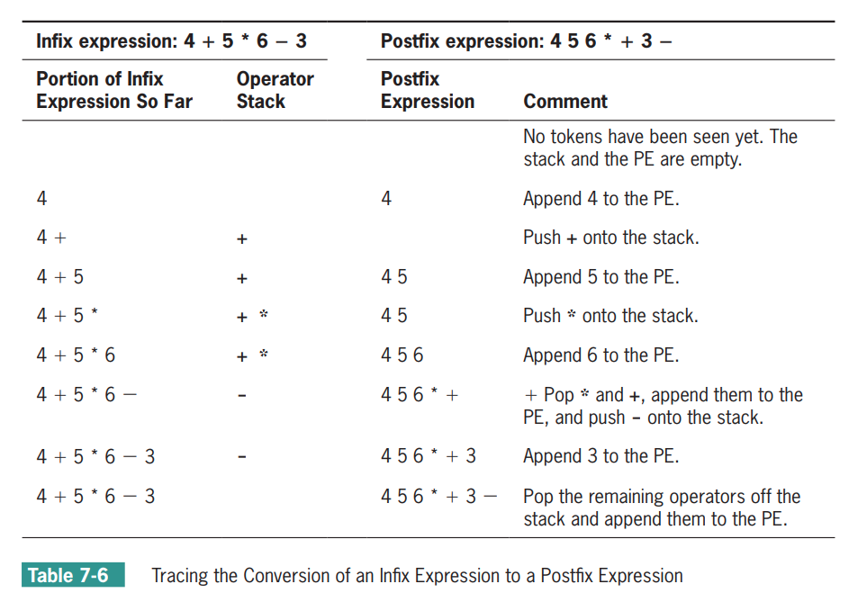
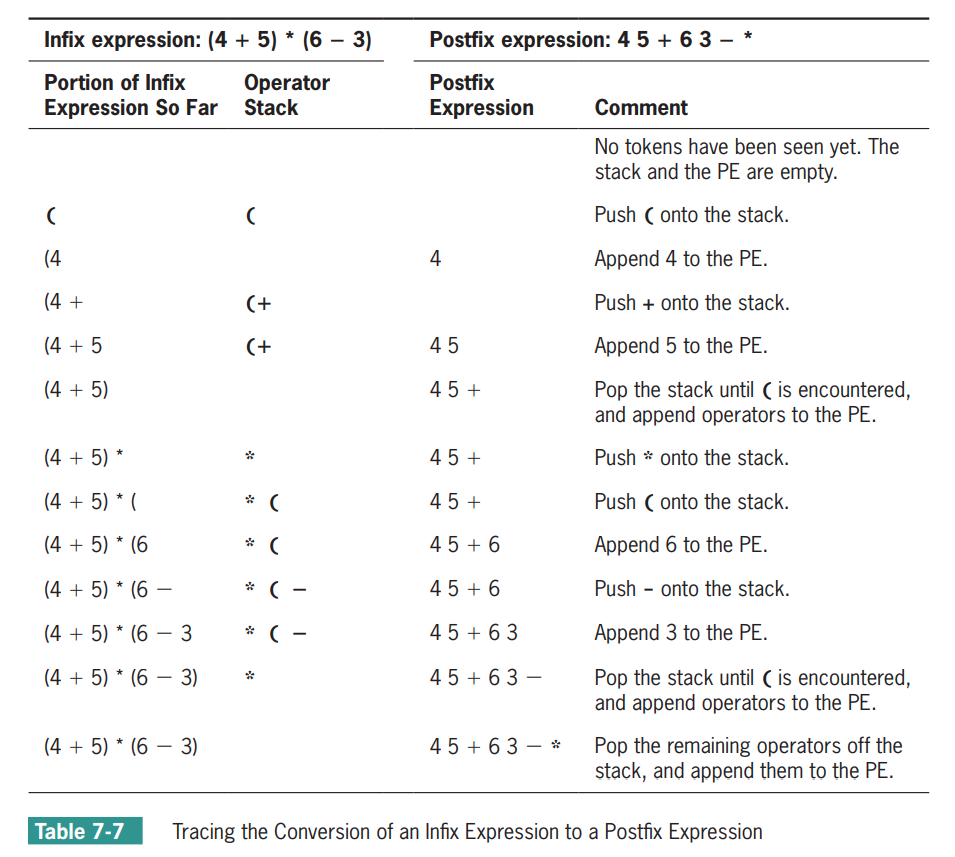
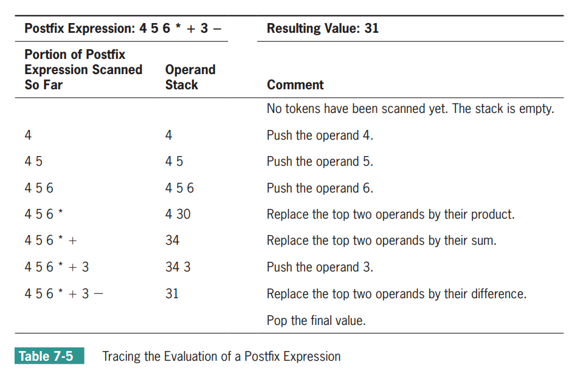

## 算术表达式计算程序：Python语言实现

本文算是数据结构与算法的学习笔记，内容来自于《数据结构 （Python语言描述）》这本书。

以下记录了如何通过Python语言实现算术表达式计算程序的过程。

我们将按照软件工程的基本步骤来介绍：
- 需求
- 分析
- 设计
- 实现

### 程序的需求

我们的程序具有如下功能：
- 用户在提示符下输入一个算术表达式，然后程序会显示该表达式的值，
- 如果该表达式无效的话，则显示错误消息。

这是程序交互的一个示例：
```
Enter an infix expression: 12 + 3 * 2 - 10 / 2
12 + 3 * 2 - 10 / 2
13

Enter an infix expression: 12 - 4 * 5
12 - 4 * 5
-8

Enter an infix expression: (12 - 4) * 5
( 12 - 4 ) * 5
40

Enter an infix expression: (12 - 4 * 5
( 12 - 4 * 5
Too few operators(No matching opening right parenthese found)
Portion of infix expression processed: ( 12 - 4 * 5
Operators on the stack          : [(]

Enter an infix expression: 12 - 4) * 5
12 - 4 ) * 5
Too few operators(No matching opening left parenthese found)
Portion of infix expression processed: 12 - 4 )
The stack is empty

Enter an infix expression: 12 + * 3
12 + * 3
Too few operands on the stack
Portion of infix expression processed: 12 + * 3
The stack is empty
Portion of postfix expression processed: 12 3 * +
Operands on the stack          : [36]

Enter an infix expression: 23 + 34 34
23 + 34 34
Too many operands on the stack
Portion of infix expression processed: 23 + 34 34
The stack is empty
Portion of postfix expression processed: 23 34 34 +
Operands on the stack          : [23, 68]

Enter an infix expression: 12 % 2 + 4
12 % 2 + 4
Unrecognized symbol
Portion of infix expression processed: 12 %
The stack is empty

Enter an infix expression: 12 + 4 / 0
12 + 4 / 0
integer division or modulo by zero
Portion of infix expression processed: 12 + 4 / 0
The stack is empty
Portion of postfix expression processed: 12 4 0 /
Operands on the stack          : [12]

Enter an infix expression:
```

我们的程序中支持的算术表达式具有以下限制：
- 算术表达式采取中缀表示法（即日常的数学表达式）
- 运算数只支持正整数（负整数可以通过`0 - 正整数`获取）
- 运算符支持加、减、乘、除四则运算，优先级复合标准的四则运算
- 表达式支持括号`()`，支持嵌套的括号`()`

输入输出的格式具有以下限制：
- 输入表达式的时候，限定表达式在一行文本之内，
- 运算数和运算符之间可以有任意空白。
- 当用户按下了Enter键之后，按照在每个符号之间只有一个空格的项是显示表达式，
- 在后面新的一行开始，紧跟着的是表达式的值或者错误消息，
- 用户通过在提示符直接按下Enter键来退出。

程序中检测并报告一些输入错误：
- 不匹配的括号，
- 表达式包含太少的运算数，
- 表达式包含太多的运算数，
- 表达式包含了不识别的符号：程序期待表达式包含整数、4中运算符（+、-、*、/）以及空白（空格和制表符）。任何其他内容都是不识别的。
- 表达式包含了除以0的情况。

### 程序的分析

我们计算算术表达式的处理过程主要分为两大步骤
- 将中缀表达式转化成等价的后缀表达式，
- 计算后缀表达式，获取结果

所以我们设计的类中，首先想到的实现中缀转后缀和计算后缀表达式的类：
- IFToPFConverter类：中缀表达式转后缀表达式的类
- PFEvaluator类：计算后缀表达式的类
- Stack类：栈类，中缀表达式转后缀表达式，以及后缀表达式的计算中都会用到

另外，将输入的一行表达式转换成符号序列的功能，也需要两个类：
- Token类：表示符号，包括运算数和运算符
- Scanner类：扫描一行字符串，转化成符号序列

顶层采用了视图和模型的模式：
- IFEvaluatorView类：视图类
    + 视图要求模型按照每个符号之间只有一个空格的格式来格式化表达式字符串，然后，显示格式化后的字符串。
    + 视图要求模型计算表达式，然后显示返回的值
    + 视图捕获模型所抛出的任何异常，要求模型给出当检测到错误的时候的参照条件，并且显示相应的错误信息。
- IFEvaluatorModel类：模型类
    + 它必须能够格式化并计算表达式字符串
    + 它可以引发异常以响应字符串中的语法错误，并且报告其内部状态。

具体的类关系图如下：


### 程序的设计

我们接下来给出每个类的具体接口和含义。

首先根据类关系图，给出对应的类之间接口交互图。


接下来分别罗列各个类的接口和含义。

1. IFEvaluatorView类

    - 主要的方法就一个run()，具体的代码逻辑如下图：

    

2. IFEvaluatorModel类

    模型包括format()、evaluate()和evaluationStatus()这三个方法，下面分别说明：

    - format(expressionStr)的流程如下图：

    

    - evaluate(expressionStr)的流程很简单：
        + 创建一个IFToPFConverter类对象，将Scanner(expressionStr)传入IFToPFConverter，获取后缀表达式
        + 创建一个PFEvaluator类对象，将Scanner(后缀表达式字符串)传入PFEvaluator，返回计算结果

    - evaluationStatus()：
        + 获取IFToPFConverter的状态信息和PFEvaluator的状态信息并返回

3. IFToPFConverter类

    包括构造函数，以及convert()和conversionStatus()方法：

    - 构造函数IFToPFConverter(scanner)：
        + 创建operatorStack，用来存放运算符的栈
        + 保存传入的scanner

    - convert()：
        + 遍历scanner中的Token
        + 返回后缀表达式的Token列表

    - conversionStatus()返回多行字符串：
        + 已经被处理的表达式字符串部分
        + 当前operatorStack上的符号

4. PFEvaluator类

    包括构造函数，以及evaluate()和evaluationStatus()方法：

    - 构造函数PFEvaluator(scanner)：
        + 创建operandStack，用来存放运算数的栈
        + 保存传入的scanner

    - evaluate()：
        + 遍历scanner中的Token
        + 返回后缀表达式的计算结果

    - evaluationStatus()返回多行字符串：
        + 已经被处理的表达式字符串部分
        + 当前operandStack上的符号

5. Scanner类

    包括构造函数，以及hasNext()和next()方法：

    - 构造函数Scanner(sourceStr)：保存sourceStr字符串，用作后续扫描并提取符号（Token）
    - hasNext()：如果字符串序列中还有下一个符号（Token），返回True，否则返回False
    - next()：返回下一个符号（Token），如果hasNext()返回Flase了，则抛出异常。

6. Token类

    包含两个成员变量：`_type`和`_value`。

    - `_type`标识符号的类型：运算数还是运算符，以及哪种运算符，`_type`是如下的Token类变量之一：
        ```
        UNKNOWN  = 0        # unknown
        
        INT      = 4        # integer
                
        MINUS    = 5        # minus    operator
        PLUS     = 6        # plus     operator
        MUL      = 7        # multiply operator
        DIV      = 8        # divide   operator
        LPAR     = 9        # left par operator
        RPAR     = 10       # rightpar operator
        ```
    - `_value`保存运算符数的值，或者预算符的字符串内容。

    包含构造函数，以及getType()、getValue()和isOperator()方法：

    - 构造函数Token(value):
        + 如果value是个整数，创建个Token.INT类型的Token对象
        + 否则创建个运算符类型的Token对象（根据运算符的字符串内容创建具体的运算符Token）

    - getType()：返回Token的类型
    - getValue()：返回Token的值。
    - isOperator()：判断Token是否为运算符。
    - getPrecedence()：返回运算符的优先级。

7. Stack类

    通用的栈容器实现，主要用到了peek()、push()和pop()方法：

    - peek()：返回栈顶部的项，如果栈为空，抛出异常。
    - push(item)：在栈的顶部添加一项。
    - pop()：在栈的顶部删除一项并返回该项。

### 程序的实现

下面按照设计中类的顺序给出Python实现代码，必要的地方会给出一些解释。

1. IFEvaluatorView类：IFEvaluatorView.py

```py
#!/usr/bin/env python3

from IFEvaluatorModel import IFEvaluatorModel

class IFEvaluatorView:

    def run(self):
        evaluator = IFEvaluatorModel()
        while True:
            sourceStr = input("Enter an infix expression: ")
            if sourceStr == "": break
            try:
                print(evaluator.format(sourceStr))
                print(evaluator.evaluate(sourceStr))
            except Exception as e:
                print(e)
                print(evaluator.evaluationStatus())
            print()

IFEvaluatorView().run()
```

2. IFEvaluatorModel类：IFEvaluatorModel.py

```py
#!/usr/bin/env python3

from io import StringIO
from Scanner import Scanner
from PFEvaluator import PFEvaluator
from IFToPFConverter import IFToPFConverter

class IFEvaluatorModel:
   
    def evaluate(self, sourceStr):
        self.evaluator = None
        self.converter = IFToPFConverter(Scanner(sourceStr))
        postfixStr = self.converter.convert()
        self.evaluator = PFEvaluator(Scanner(postfixStr))
        value = self.evaluator.evaluate()
        return value

    def format(self, sourceStr):
        normalizedStr = ""
        scanner = Scanner(sourceStr);
        while scanner.hasNext():
            normalizedStr += str(scanner.next()) + " "
        return normalizedStr;

    def evaluationStatus(self):
        """Check to see if an evaluation has been done first."""
        result = str(self.converter)
        if self.evaluator:
            result += "\n" + str(self.evaluator)
        return result

def test_evaluator(evaluator, sourceStr):
    try:
        print(evaluator.format(sourceStr))
        print(evaluator.evaluate(sourceStr))
    except Exception as e:
        print(e)
        print(evaluator.evaluationStatus())

def main():
    # A simple tester program
    evaluator = IFEvaluatorModel()
    test_evaluator(evaluator, "8 + 2 * 3")
    test_evaluator(evaluator, "(8 + 2) * 3")
    test_evaluator(evaluator, "(8 + 2 * 3")
    test_evaluator(evaluator, "8 + 2) * 3")

if __name__ == "__main__":
    main()
```

3. IFToPFConverter类：IFToPFConverter.py

```py
#!/usr/bin/env python3

from Token import Token
from Scanner import Scanner
from Stack import Stack

class IFToPFConverter:

    def __init__(self, scanner):
        self.expressionSoFar = ""
        self.operatorStack = Stack()
        self.scanner = scanner

    def convert(self):
        postfix = list()
        while self.scanner.hasNext():
            currentToken = self.scanner.next()
            self.expressionSoFar += str(currentToken) + " "
            if currentToken.getType() == Token.UNKNOWN:
                raise AttributeError("Unrecognized symbol")
            if currentToken.getType() == Token.INT:
                postfix.append(str(currentToken))
            elif currentToken.getType() == Token.LPAR:
                self.operatorStack.push(currentToken)
            elif currentToken.getType() == Token.RPAR:
                if self.operatorStack.isEmpty():
                    raise AttributeError("Too few operators(No matching opening left parenthese found)")
                topOperator = self.operatorStack.pop()
                while topOperator.getType() != Token.LPAR:
                    postfix.append(str(topOperator))
                    if self.operatorStack.isEmpty():
                        raise AttributeError("Too few operators(No matching opening left parenthese found)")
                    topOperator = self.operatorStack.pop()
            else:
                while not self.operatorStack.isEmpty() and \
                      self.operatorStack.peek().getPrecedence() >= currentToken.getPrecedence():
                    postfix.append(str(self.operatorStack.pop()))
                self.operatorStack.push(currentToken)
        while not self.operatorStack.isEmpty():
            if self.operatorStack.peek().getType() == Token.LPAR:
                raise AttributeError("Too few operators(No matching opening right parenthese found)")
            postfix.append(str(self.operatorStack.pop()))
        return " ".join(postfix)
   
    def __str__(self):
        result = ""
        if self.expressionSoFar == "":
            result += "Portion of infix expression processed: none\n"
        else: 
            result += "Portion of infix expression processed: " + \
                   self.expressionSoFar + "\n"
        if self.operatorStack.isEmpty():
            result += "The stack is empty"
        else:
            result += "Operators on the stack          : " + \
                      str(self.operatorStack)
        return result

    def conversionStatus(self):
        return str(self)

    
def main():
    while True:
        sourceStr = input("Enter an infix expression: ")
        if sourceStr == "":
            break
        else:
            try:
                converter = IFToPFConverter(Scanner(sourceStr))
                print("Postfix:", converter.convert())
            except Exception as e:
                print(e)
                print(converter.conversionStatus())

if __name__ == "__main__":
    main()
```

IFToPFConverter.convert()函数的具体步骤如下：
    1. 开始的时候，有一个空的后缀表达式（postfix）和一个空的栈（operatorStack），栈用来保存运算符和左括号。
    2. 从左向右扫描中缀表达式。
    3. 遇到一个运算数的时候，将其添加到后缀表达式的后面。
    4. 遇到一个左括号的时候，将其压入到栈中。
    5. 遇到一个运算符，从栈中弹出和它具有相等的或更高优先级的所有运算符，将它们添加到后缀表达式的末尾，然后，将扫描到的运算符压入到栈中。
    6. 遇到一个右括号的时候，将运算符从栈中移动到后缀表达式中，直到遇到了与之匹配的左括号，并将其丢弃。
    7. 遇到中缀表达式结束的时候，将栈中剩下的运算符都转移到后缀表达式之中。

表7.6和表7.7举例说明了这个过程。






4. PFEvaluator类：PFEvaluator.py

```py
#!/usr/bin/env python3

from Token import Token
from Scanner import Scanner
from Stack import Stack

class PFEvaluator:
   
    def __init__(self, scanner):
        self.expressionSoFar = ""
        self.operandStack = Stack()
        self.scanner = scanner

    def evaluate(self):
        while self.scanner.hasNext():
            currentToken = self.scanner.next()
            self.expressionSoFar += str(currentToken) + " "
            if currentToken.getType() == Token.INT:
                self.operandStack.push(currentToken)
            elif currentToken.isOperator(): 
                if len(self.operandStack) < 2:
                    raise AttributeError("Too few operands on the stack")
                t2 = self.operandStack.pop()
                t1 = self.operandStack.pop()
                result = Token(self.computeValue(currentToken,
                                                 t1.getValue(),
                                                 t2.getValue()))
                self.operandStack.push(result)

            else:
                raise AttributeError("Unknown token type")
        if len(self.operandStack) > 1:
            raise AttributeError("Too many operands on the stack")
        result = self.operandStack.pop()
        return result.getValue();   

    def __str__(self):
        result = ""
        if self.expressionSoFar == "":
            result += "Portion of postfix expression processed: none\n"
        else: 
            result += "Portion of postfix expression processed: " + \
                   self.expressionSoFar + "\n"
        if self.operandStack.isEmpty():
            result += "The stack is empty"
        else:
            result += "Operands on the stack          : " + \
                      str(self.operandStack)
        return result

    def evaluationStatus(self):
        return str(self)

    def computeValue(self, op, value1, value2):
        result = 0;
        theType = op.getType()
        if theType == Token.PLUS:
            result = value1 + value2;
        elif theType == Token.MINUS:
            result = value1 - value2;
        elif theType == Token.MUL:
            result = value1 * value2;
        elif theType == Token.DIV:
            result = value1 // value2;
        else:
            raise Exception("Unknown operator")
        return result


def main():
    while True:
        sourceStr = input("Enter a postfix expression: ")
        if sourceStr == "":
            break
        else:
            try:
                evaluator = PFEvaluator(Scanner(sourceStr))
                print("Result:", evaluator.evaluate())
            except Exception as e:
                print(e)
                print(evaluator.evaluationStatus())

if __name__ == "__main__":
    main()
```


PFEvaluator.evaluate()函数的具体步骤如下：
    1. 开始的时候，有一个空的栈（operandStack），栈用来保存运算数和运算结果。
    2. 从左向右扫描后缀表达式。
    3. 遇到一个运算数的时候，将其压入到栈中。
    4. 遇到一个运算符的时候，从栈中弹出两个运算数，并且对这两个运算数应用该运算符，并且将结果压入栈中。
    5. 继续遍历，直到到达了表达式的末尾，此时，只剩下表达式的值。

表7.5举例说明了这个过程。




5. Scanner类：Scanner.py

```py
#!/usr/bin/env python3

from Token import Token

class Scanner:

    EOE = ';'        # end-of-expression
    TAB = '\t'       # tab

    def __init__(self, sourceStr):
        self.sourceStr = sourceStr
        self.getFirstToken()

    def hasNext(self):
        return self.currentToken != None

    def next(self):
        if not self.hasNext():
            raise Exception("There are no more tokens")           
        temp = self.currentToken
        self.getNextToken()
        return temp

    def getFirstToken(self):
        self.index = 0
        self.currentChar = self.sourceStr[0]
        self.getNextToken()
    
    def getNextToken(self):
        self.skipWhiteSpace()
        if self.currentChar.isdigit():
            self.currentToken = Token(self.getInteger())
        elif self.currentChar == Scanner.EOE:
            self.currentToken = None
        else:
            self.currentToken = Token(self.currentChar)
            self.nextChar()
    
    def nextChar(self):
        if self.index >= len(self.sourceStr) - 1:
            self.currentChar = Scanner.EOE
        else:
            self.index += 1
            self.currentChar = self.sourceStr[self.index]
    
    def skipWhiteSpace(self):
        while self.currentChar in (' ', Scanner.TAB):
            self.nextChar()
    
    def getInteger(self):
        num = 0
        while True:
            num = num * 10 + int(self.currentChar)
            self.nextChar()
            if not self.currentChar.isdigit():
                break
        return num


def main():
    # A simple tester program
    while True:
        sourceStr = input("Enter an expression: ")
        if sourceStr == "": break
        scanner = Scanner(sourceStr)
        while scanner.hasNext():
            print(scanner.next())

if __name__ == '__main__': 
    main()
```

6. Token类：Token.py

```py
#!/usr/bin/env python3

class Token:

    UNKNOWN  = 0        # unknown
    
    INT      = 4        # integer
            
    MINUS    = 5        # minus    operator
    PLUS     = 6        # plus     operator
    MUL      = 7        # multiply operator
    DIV      = 8        # divide   operator
    LPAR     = 9        # left par operator
    RPAR     = 10       # rightpar operator

    FIRST_OP = 5        # first operator code

    def __init__(self, value):
        if type(value) == int:
            self._type = Token.INT
        else:
            self._type = self._makeType(value)
        self._value = value

    def isOperator(self):
        return self._type >= Token.FIRST_OP

    def __str__(self):
        return str(self._value)
    
    def getType(self):
       return self._type
    
    def getValue(self):
       return self._value

    def _makeType(self, ch):
        if   ch == '*': return Token.MUL
        elif ch == '/': return Token.DIV
        elif ch == '+': return Token.PLUS
        elif ch == '-': return Token.MINUS
        elif ch == '(': return Token.LPAR
        elif ch == ')': return Token.RPAR
        else:           return Token.UNKNOWN

    def getPrecedence(self):
        """Returns the precedunce level of an operator."""
        myType = self._type
        if myType in (Token.MUL, Token.DIV):
            return 2
        elif myType in (Token.PLUS, Token.MINUS):
            return 1
        else:
            return 0

def main():
    # A simple tester program
    plus = Token("+")
    minus = Token("-")
    mul = Token("*")
    div = Token("/")
    unknown = Token("#")
    anInt = Token(34)
    print(plus, minus, mul, div, unknown, anInt)

if __name__ == '__main__': 
    main()
```

7. Stack类：Stack.py

```py
class Stack:
    def __init__(self):
        self.items = list()

    def __len__(self):
        return len(self.items)

    def __str__(self):
        return "[" + ", ".join(map(str, self.items)) + "]"

    def __iter__(self):
        return iter(self.items)

    def isEmpty(self):
        return len(self.items) == 0

    def push(self, item):
        self.items.append(item)

    def pop(self):
        if self.isEmpty():
            raise KeyError("The stack is empty")
        return self.items.pop()

    def peek(self):
        if self.isEmpty():
            raise KeyError("The stack is empty")
        return self.items[-1]

    def clear(self):
        self.items = list()
```

Stack类就是简单地对列表类的封装。


最后给出Python实现的工程代码路径：  
<https://github.com/hexu1985/Data.Structures.And.Algorithms.Tutorial/tree/master/evaluating_postfix_expressions/blog/python>


### 参考文档：

- 《数据结构（Python语言描述）》
- 《Fundamentals of Python Data Structures 2ND EDITION》

