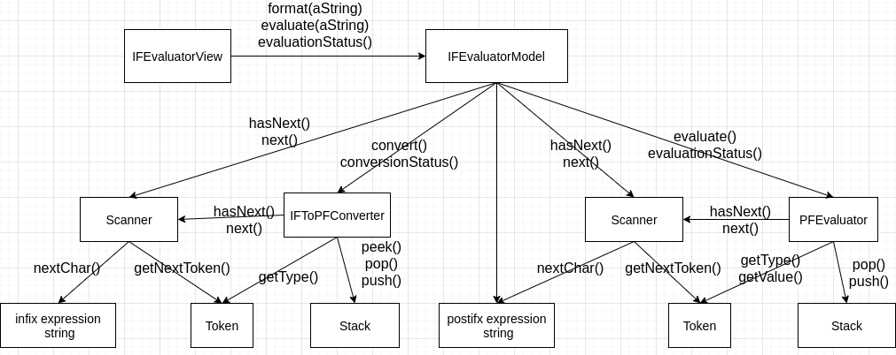

## 算术表达式计算程序：Python语言实现

本文介绍通过Python语言实现算术表达式计算程序的过程。

我们将按照软件工程的基本步骤来介绍：
- 需求
- 分析
- 设计
- 实现

### 程序的需求

我们的程序具有如下功能：
- 用户在提示符下输入一个算术表达式，然后程序会显示该表达式的值，
- 如果该表达式无效的话，则显示错误消息。

这是程序交互的一个示例：
```
Enter an infix expression: 12 + 3 * 2 - 10 / 2
12 + 3 * 2 - 10 / 2
13

Enter an infix expression: 12 - 4 * 5
12 - 4 * 5
-8

Enter an infix expression: (12 - 4) * 5
( 12 - 4 ) * 5
40

Enter an infix expression: (12 - 4 * 5
( 12 - 4 * 5
Too few operators(No matching opening right parenthese found)
Portion of infix expression processed: ( 12 - 4 * 5
Operators on the stack          : [(]

Enter an infix expression: 12 - 4) * 5
12 - 4 ) * 5
Too few operators(No matching opening left parenthese found)
Portion of infix expression processed: 12 - 4 )
The stack is empty

Enter an infix expression: 12 + * 3
12 + * 3
Too few operands on the stack
Portion of infix expression processed: 12 + * 3
The stack is empty
Portion of postfix expression processed: 12 3 * +
Operands on the stack          : [36]

Enter an infix expression: 23 + 34 34
23 + 34 34
Too many operands on the stack
Portion of infix expression processed: 23 + 34 34
The stack is empty
Portion of postfix expression processed: 23 34 34 +
Operands on the stack          : [23, 68]

Enter an infix expression: 12 % 2 + 4
12 % 2 + 4
Unrecognized symbol
Portion of infix expression processed: 12 %
The stack is empty

Enter an infix expression: 12 + 4 / 0
12 + 4 / 0
integer division or modulo by zero
Portion of infix expression processed: 12 + 4 / 0
The stack is empty
Portion of postfix expression processed: 12 4 0 /
Operands on the stack          : [12]

Enter an infix expression:
```

我们的程序中支持的算术表达式具有以下限制：
- 算术表达式采取中缀表示法（即日常的数学表达式）
- 运算数只支持正整数（负整数可以通过$0 - 正整数$获取）
- 运算符支持加、减、乘、除四则运算，优先级复合标准的四则运算
- 表达式支持括号`()`，支持嵌套的括号`()`

输入输出的格式具有以下限制：
- 输入表达式的时候，限定表达式在一行文本之内，
- 运算数和运算符之间可以有任意空白。
- 当用户按下了Enter键之后，按照在每个符号之间只有一个空格的项是显示表达式，
- 在后面新的一行开始，紧跟着的是表达式的值或者错误消息，
- 用户通过在提示符直接按下Enter键来退出。

程序中检测并报告一些输入错误：
- 不匹配的括号，
- 表达式包含太少的运算数，
- 表达式包含太多的运算数，
- 表达式包含了不识别的符号：程序期待表达式包含整数、4中运算符（+、-、*、/）以及空白（空格和制表符）。任何其他内容都是不识别的。
- 表达式包含了除以0的情况。

### 程序的分析

我们计算算术表达式的处理过程主要分为两大步骤
- 将中缀表达式转化成等价的后缀表达式，
- 计算后缀表达式的结果

所以我们的设计中，首先想到的实现中缀转后缀和计算后缀表达式的类：
- IFToPFConverter类：中缀表达式转后缀表达式的类
- PFEvaluator类：计算后缀表达式的类
- Stack类：栈类，中缀表达式转后缀表达式，以及后缀表达式的计算中都会用到

另外，将输入的一行表达式转换成符号序列的功能，也需要两个类：
- Token类：表示符号，包括运算数和运算符
- Scanner类：扫描一行字符串，转化成符号序列

顶层采用了视图和模型的模式：
- IFEvaluatorView类：视图类
    + 视图要求模型按照每个符号之间只有一个空格的格式来格式化表达式字符串，然后，显示格式化后的字符串。
    + 视图要求模型计算表达式，然后显示返回的值
    + 视图捕获模型所抛出的任何异常，要求模型给出当检测到错误的时候的参照条件，并且显示相应的错误信息。
- IFEvaluatorModel类：模型类
    + 它必须能够格式化并计算表达式字符串
    + 它可以引发异常以响应字符串中的语法错误，并且报告其内部状态。

具体的类关系图如下：


### 程序的设计

我们接下来给出每个类的具体接口和含义。

首先根据类关系图，给出对应的类之间接口交互图。



接下来分别罗列各个类的接口和含义。

1. IFEvaluatorView类

主要的方法就一个run()，具体的代码逻辑如下图：


