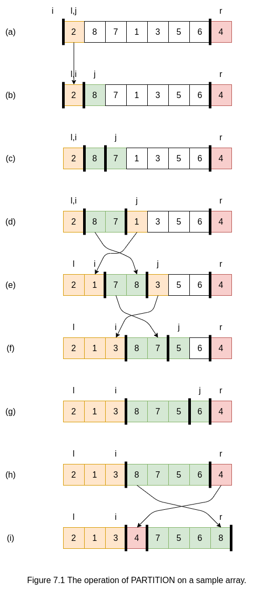

## 手把手实现快速排序：python/C++语言描述

### 什么是快速排序？

快速排序是一种常用的排序算法，比选择排序快得多。例如，C语言标准库中的函数qsort
实现的就是快速排序。像归并排序（merge sort）一样，快速排序也是一种分治的递归算法。

### 快速排序算法的步骤和说明

将数组$S$排序的基本算法由下列简单的四步组成：
1. 如果$S$中的元素个数是$0$和$1$，则返回。
2. 取$S$中任一元素$v$，称之为**枢纽元**（privot）。
3. 将$S - \{v\}$（即S中其余元素）划分成两个不相交的集合：$S_{1} = \{ x \in S - \{v\} | x \le v \}$，$S_{2} = \{ x \in S - \{v\} | x \ge v \}$。
4. 返回$\{quicksort(S_{1})，后跟v，继而再quicksort(S_{2})\}$。

下图给出快速排序算法的直观说明：

### 快速排序算法的伪码

下面是对一个典型的子数组A[l..r]进行快速排序的伪代码：

> QuickSort(A, l, r)
> 1 if l >= r
> 2     return
> 3 i = Partition(A, l, i - 1)
> 4 QuickSort(A, l, i - 1)
> 5 QuickSort(A, i + 1, r)

而算法的核心是Partition过程：

> Partition(A, l, r)
> 1 p = A[r]
> 2 i = l - 1
> 3 for j = l to r - 1
> 4     if A[j] <= p
> 5         i = i + 1
> 6         exchange A[i] with A[j]
> 7 exchange A[i + 1] with A[r]
> 8 return i + 1

下图显示了Partition如何在一个包含8个元素的数组上进行操作的过程。

