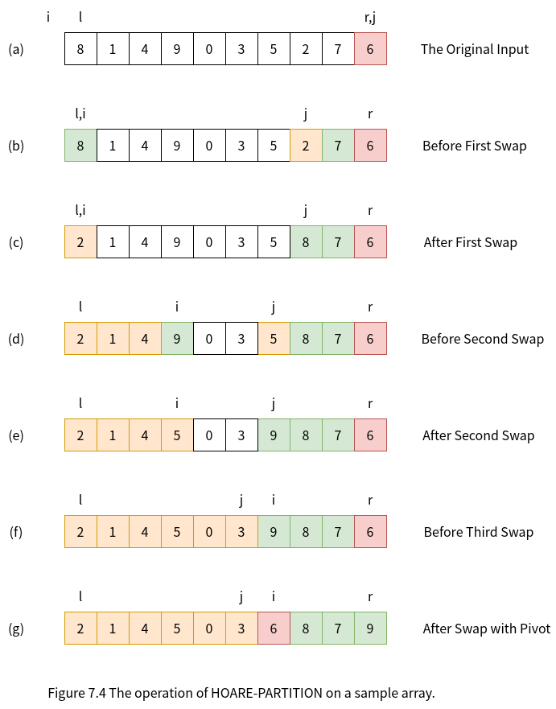

## 手把手实现快速排序：Python语言实现

### 什么是快速排序？

快速排序是一种常用的排序算法，比选择排序快得多。例如，C语言标准库中的函数qsort
实现的就是快速排序。像归并排序（merge sort）一样，快速排序也是一种分治的递归算法。

### 快速排序算法的步骤和说明

将数组$S$排序的基本算法由下列简单的四步组成：
1. 如果$S$中的元素个数是$0$和$1$，则返回。
2. 取$S$中任一元素$v$，称之为**枢纽元**（pivot）。
3. 将$S - \{v\}$（即S中其余元素）划分成两个不相交的集合：$S_{1} = \{ x \in S - \{v\} | x \le v \}$，$S_{2} = \{ x \in S - \{v\} | x \ge v \}$。
4. 返回$\{quicksort(S_{1})，后跟v，继而再quicksort(S_{2})\}$。

下图给出快速排序算法的直观说明：


### 快速排序算法的伪码和说明

下面是对一个典型的子数组$A[l..r]$进行快速排序的伪代码：

> QuickSort(A, l, r)
> 1 if l >= r
> 2     return
> 3 i = Partition(A, l, r)
> 4 QuickSort(A, l, i - 1)
> 5 QuickSort(A, i + 1, r)

而算法的核心是Partition过程：

> Partition(A, l, r)
> 1 p = A[r]
> 2 i = l - 1
> 3 for j = l to r - 1
> 4     if A[j] <= p
> 5         i = i + 1
> 6         exchange A[i] with A[j]
> 7 exchange A[i + 1] with A[r]
> 8 return i + 1

下图显示了Partition如何在一个包含8个元素的数组上进行操作的过程。


Partition总是选择一个$p = A[r]$作为**枢纽元**（pivot），并围绕它来划分子数组$A[l..r]$。
随着程序的执行，数组被划分成4个（可能有空的）区域。
在Partition伪码的第3～6行的**for**循环的每一轮迭代的开始，每一个区域都满足一定的性质，
我们将这些性质作为循环不变量：

在第3～6行循环体的每一轮迭代开始时，对于任意数组下标$k$，有：
1. 若$l \le k \le i$，则$A[k] \le p$。
2. 若$i+1 \le k \le j-1$，则$A[k] > p$。
3. 若$k = r$，则$A[k] = p$。

但是上述三种情况没有覆盖下标$j$到$r-1$，对应位置的值与枢纽元之间也不存在特定的大小关系。
如下图所示：


下图给出第3～6行循环体的每一轮迭代中，根据第4行中条件判断的不同结果，算法的不同处理。


### 快速排序算法的Python实现

基于快速排序算法的伪码，我们可以轻松的给出Python版本的实现。

首先是给出测试驱动代码：

test_quicksort.py
```py
#!/usr/bin/env python3
# test_quicksort.py

from quicksort import quicksort
import random

def main(size = 1000):
    lyst = []
    for count in range(size):
        lyst.append(random.randint(1, size + 1))

    answer = sorted(lyst)
    print(lyst)
    quicksort(lyst)
    print(lyst)

    if answer == lyst:
        print("quicksort is correct!")
    else:
        print("quicksort is not correct!")

if __name__ == "__main__":
    main() 
```

然后是quicksort的实现代码：

quicksort.py
```py
#!/usr/bin/env python3
# quicksort.py

def quicksort(lyst):
    quicksortHelper(lyst, 0, len(lyst) - 1)

def quicksortHelper(lyst, left, right):
    if left >= right:
        return
    pivotLocation = partition(lyst, left, right)
    quicksortHelper(lyst, left, pivotLocation - 1)
    quicksortHelper(lyst, pivotLocation + 1, right)

def partition(lyst, left, right):
    pivot = lyst[right]
    i = left - 1
    for j in range(left, right):    # left to right - 1
        if lyst[j] <= pivot:
            i = i + 1
            swap(lyst, i, j)
    swap(lyst, i + 1, right)
    return i + 1

def swap(lyst, i, j):
    """Exchanges the items at positions i and j."""
    # You could say lyst[i], lyst[j] = lyst[j], lyst[i]
    # but the following code shows what is really going on
    temp = lyst[i]
    lyst[i] = lyst[j]
    lyst[j] = temp
```

### 快速排序算法的改进和优化

接下来，我们逐步改进和优化快速排序，最终的算法接近于C++标准库中std::sort的实现。

**STEP1**

首先我们把Partition过程修改成最早由C.A.R.Hoare提出时的模样，
当然这里的伪码可能与最原始Hoare版本有所出入：

> Hoare-Partition(A, l, r)
> 1  p = A[r]
> 2  i = l - 1
> 3  j = r
> 4  while TRUE
> 5     repeat
> 6         i = i + 1
> 7     until A[i] >= p
> 8     repeat
> 9         j = j - 1
> 10    until j == l or A[j] <= p
> 11    if i < j
> 12        exchange A[i] with A[j]
> 13    else 
> 14        break
> 15 exchange A[i] with A[r]
> 16 return i

下图显示了Hoare-Partition如何在一个包含10个元素的数组上进行操作的过程。



更新了Partition过程的完整代码如下：

quicksort.py
```py
#!/usr/bin/env python3
# quicksort.py

def quicksort(lyst):
    quicksortHelper(lyst, 0, len(lyst) - 1)

def quicksortHelper(lyst, left, right):
    if left >= right:
        return
    pivotLocation = partition(lyst, left, right)
    quicksortHelper(lyst, left, pivotLocation - 1)
    quicksortHelper(lyst, pivotLocation + 1, right)

def partition(lyst, left, right):
    pivot = lyst[right]
    i = left - 1
    j = right
    while True:
        while True:
            i = i + 1
            if lyst[i] >= pivot:
                break
        while True:
            j = j - 1
            if j == left or lyst[j] <= pivot:
                break
        if i < j:
            swap(lyst, i, j)
        else:
            break
    swap(lyst, i, right)
    return i

def swap(lyst, i, j):
    """Exchanges the items at positions i and j."""
    # You could say lyst[i], lyst[j] = lyst[j], lyst[i]
    # but the following code shows what is really going on
    temp = lyst[i]
    lyst[i] = lyst[j]
    lyst[j] = temp
```

**STEP2**

据说，对于很小的数组（$N \le 20），快速排序不如插入排序。
所以，我们修正QuickSort算法，当数组长度小于某个值（这里选了10）时，
改成调用插入排序：

> QuickSort(A, l, r)
> 1 if r - l <= 10
> 2     return InsertionSort(A, l, r)
> 3 i = Partition(A, l, r)
> 4 QuickSort(A, l, i - 1)
> 5 QuickSort(A, i + 1, r)

由于修改一目了然，这里就直接给出Python实现：

quicksort.py
```py
#!/usr/bin/env python3
# quicksort.py

def quicksort(lyst):
    quicksortHelper(lyst, 0, len(lyst) - 1)

def quicksortHelper(lyst, left, right):
    if right - left <= 10:
        return insertionSort(lyst, left, right)
    pivotLocation = partition(lyst, left, right)
    quicksortHelper(lyst, left, pivotLocation - 1)
    quicksortHelper(lyst, pivotLocation + 1, right)

def partition(lyst, left, right):
    pivot = lyst[right]
    i = left - 1
    j = right
    while True:
        while True:
            i = i + 1
            if lyst[i] >= pivot:
                break
        while True:
            j = j - 1
            if j == left or lyst[j] <= pivot:
                break
        if i < j:
            swap(lyst, i, j)
        else:
            break
    swap(lyst, i, right)
    return i

def swap(lyst, i, j):
    """Exchanges the items at positions i and j."""
    # You could say lyst[i], lyst[j] = lyst[j], lyst[i]
    # but the following code shows what is really going on
    temp = lyst[i]
    lyst[i] = lyst[j]
    lyst[j] = temp

def insertionSort(lyst, left, right):
    i = left + 1
    while i <= right:
        itemToInsert = lyst[i]
        j = i - 1
        while j >= 0:
            if itemToInsert < lyst[j]:
                lyst[j + 1] = lyst[j]
                j -= 1
            else:
                break
        lyst[j + 1] = itemToInsert
        i += 1
```
